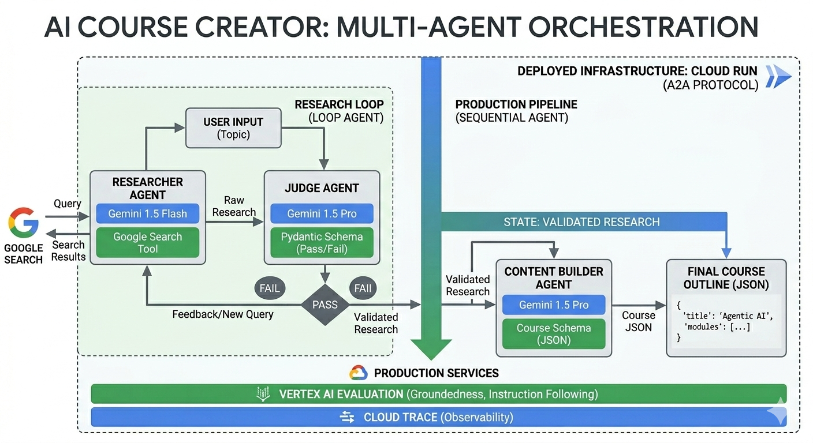

# AI Course Creator: Multi-Agent Production System

This project was developed as part of the **GDG Build with AI Workshop**. It demonstrates a production-ready multi-agent system using the **Google Agent Development Kit (ADK)** and **Gemini 1.5**.

## Overview
Unlike single-prompt chatbots, this system uses a **specialized set of agents** to research, validate, and build educational courses. It features:
- **Iterative refinement:** A Loop Agent that re-researches if the quality is low.
- **Structured outputs:** Strict Pydantic schemas for reliable data flow.
- **Production orchestration:** A Sequential Agent pipeline.

## Project Structure
- `/agents`: Definitions for Researcher, Judge, and Builder.
- `/schemas`: Pydantic models for data contracts.
- `main.py`: The Sequential & Loop orchestration logic.

## Getting Started
1. **Prerequisites:** Python 3.10+, Google Cloud Project with Vertex AI enabled.
2. **Install Dependencies:** `pip install google-cloud-aiplatform pydantic`
3. **Set Credentials:** `export GOOGLE_APPLICATION_CREDENTIALS="path/to/your/service-account.json"`
4. **Run:** `python main.py`
